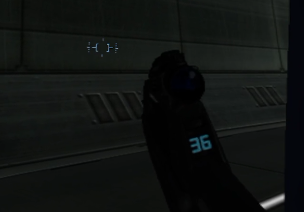

# Halo 2 reticle after tank exit — deferred report

User reports another player's minor reticle issue after exiting a tank and
explicitly asks to store it for later. No investigation or fix is requested now.

Original: C:/Users/Shadow/Downloads/bugexample1.webp. Preserved copy SHA-256:
E2FFCD3E4D7755B7B7A626B296A1C2474E3B90EBFF2146B868C7EEBDACEA50E9.
The image shows a blue bracket-like reticle above/left of a held battle rifle.
This is a visual description, not a diagnosis. Exact intended/correct reticle,
MCC edition, H2 renderer, source build, runtime and headset are not identified.
